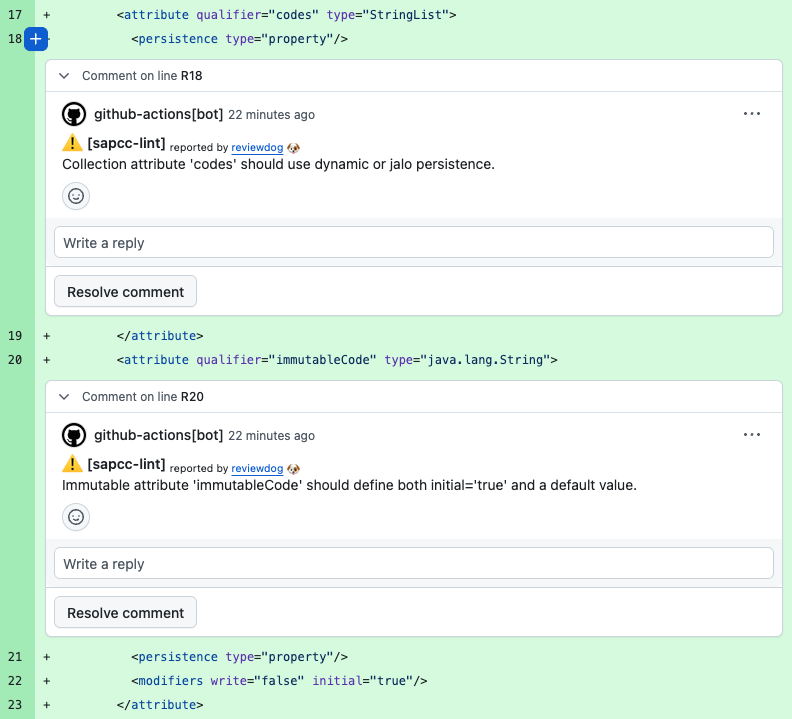

# SAP Commerce Static Code Analysis

Standalone SAP Commerce static analysis for local validation, CI, and reusable GitHub Actions.

The analyzer scans supported SAP Commerce source domains and reports findings in console, HTML, CSV, SARIF, and rdjsonl formats. It is intended for repository validation in local development, pull requests, and shared CI workflows.

This project is based on the SAP Commerce IntelliJ IDEA plugin inspection surface from EPAM's [sap-commerce-intellij-idea-plugin](https://github.com/epam/sap-commerce-intellij-idea-plugin) repository.

## What It Checks

The current analyzer covers these domains:

- `type-system`: `*-items.xml`
- `project`: `extensioninfo.xml`, `localextensions.xml`
- `manifest`: `core-customize/manifest.json`
- `impex`: `*.impex`
- `bean-system`: `*-beans.xml` and Spring-style XML files with a `beans` root tag
- `cockpit-ng`: cockpit config and widgets XML
- `business-process`: process XML

Detailed rule coverage lives in [docs/rules.md](docs/rules.md).

Example pull-request review comments from the reusable workflow:



## Requirements

- Java 17

## Quick Start

Build the distribution and run the installed launcher:

```bash
./gradlew installDist
./build/install/sap-cc-static-code-analysis/bin/sap-cc-static-code-analysis \
  scan \
  --repo /path/to/sap-commerce-repo
```

You can also run a subdirectory instead of a full repository:

```bash
./build/install/sap-cc-static-code-analysis/bin/sap-cc-static-code-analysis \
  scan \
  --repo /path/to/sap-commerce-repo/core-customize/eurofred
```

If the config file is not inside the directory you pass to `--repo`, point to it explicitly:

```bash
./build/install/sap-cc-static-code-analysis/bin/sap-cc-static-code-analysis \
  scan \
  --repo /path/to/sap-commerce-repo/core-customize/eurofred \
  --config /path/to/sap-commerce-repo/.sapcc-lint.yml
```

Filter reported findings and exit-code enforcement to a newline-delimited file list while still analyzing the full repository for context:

```bash
./build/install/sap-cc-static-code-analysis/bin/sap-cc-static-code-analysis \
  scan \
  --repo /path/to/sap-commerce-repo \
  --report-paths-file build/changed-files.txt
```

Limit the scan to selected domains by repeating `--domain`:

```bash
./build/install/sap-cc-static-code-analysis/bin/sap-cc-static-code-analysis \
  scan \
  --repo /path/to/sap-commerce-repo \
  --domain type-system \
  --domain bean-system
```

## Outputs

Console output is enabled by default.

Generate SARIF for GitHub code scanning:

```bash
./build/install/sap-cc-static-code-analysis/bin/sap-cc-static-code-analysis \
  scan \
  --repo /path/to/sap-commerce-repo \
  --format console \
  --format sarif \
  --sarif-out build/reports/sapcc-lint.sarif
```

Generate rdjsonl for reviewdog:

```bash
./build/install/sap-cc-static-code-analysis/bin/sap-cc-static-code-analysis \
  scan \
  --repo /path/to/sap-commerce-repo \
  --format console \
  --format rdjsonl \
  --rdjsonl-out build/reports/sapcc-lint.rdjsonl
```

Generate a readable standalone HTML report:

```bash
./build/install/sap-cc-static-code-analysis/bin/sap-cc-static-code-analysis \
  scan \
  --repo /path/to/sap-commerce-repo \
  --format console \
  --format html \
  --html-out build/reports/sapcc-lint.html
```

Generate a one-row-per-finding CSV export:

```bash
./build/install/sap-cc-static-code-analysis/bin/sap-cc-static-code-analysis \
  scan \
  --repo /path/to/sap-commerce-repo \
  --format console \
  --format csv \
  --csv-out build/reports/sapcc-lint.csv
```

Exit codes:

- `0`: no error-level findings
- `1`: at least one error-level finding, or invalid CLI arguments
- `2`: internal or parsing failure

## Configuration

The analyzer looks for `.sapcc-lint.yml` in the scan root by default. Use `--config` to override that path.

Example:

```yaml
analysis:
  mode: auto
paths:
  exclude:
    - generated/**
    - legacy/**
domains:
  impex:
    enabled: false
rules:
  ImpExMissingValueGroupInspection:
    severity: warning
  BSDomElementsInspection:
    severity: error
  ImpExOrphanValueGroupInspection:
    enabled: false
```

Deep-dive configuration guidance lives in [docs/configuration.md](docs/configuration.md).

## Reusable GitHub Actions Workflow

This repository publishes a reusable workflow at `.github/workflows/sapcc-lint-reusable.yml`.

Consumer repositories can call it like this:

```yaml
name: sapcc-lint

on:
  pull_request:

jobs:
  analyze:
    permissions:
      contents: read
      pull-requests: write
      security-events: write
    uses: <owner>/<repo>/.github/workflows/sapcc-lint-reusable.yml@v0.1.5
    with:
      version: v0.1.5
      repo_path: .
      html_report: true
      csv_report: true
```

Pin the workflow reference and the `version` input to the same published release tag, for example `v0.1.5`.

Reusable workflow inputs, artifact behavior, reviewdog behavior, and release pinning are documented in [docs/github-actions.md](docs/github-actions.md).

The reusable workflow always downloads the analyzer ZIP from `commerce-cloud-integrations/sap-commerce-static-code-analysis` releases. Consumer repositories only need to pin the workflow ref and `version` input to the same published tag.

On pull requests, the reusable workflow analyzes the whole repository for cross-file context but filters console output, downloadable reports, reviewdog input, and exit-code enforcement to the changed files by default. Set `pull_request_changed_files_only: false` if you want full-repository PR artifacts and gating instead.

By default, the reusable workflow enables both SARIF upload and reviewdog comments. That means a consumer pull request can show both GitHub Code Scanning annotations and reviewdog review comments for the same changed lines.

If you want only one reporting channel:

- set `upload_sarif: false` to keep reviewdog comments but disable Code Scanning annotations
- set `reviewdog_comments: false` to keep Code Scanning annotations but disable reviewdog comments

If a SARIF report exceeds GitHub code scanning's per-run result limit, the workflow skips SARIF upload automatically and emits a warning while still enforcing the analyzer exit code and uploading the requested HTML or CSV artifacts.

## Documentation

- [docs/scanning.md](docs/scanning.md): how `--repo` works, recursive discovery, subdirectory scans, excludes, and partial-repository behavior
- [docs/configuration.md](docs/configuration.md): `.sapcc-lint.yml` schema, examples, and severity tuning
- [docs/reporting.md](docs/reporting.md): console, HTML, CSV, SARIF, and rdjsonl report behavior and output use cases
- [docs/rules.md](docs/rules.md): rule families and rule IDs by domain
- [docs/github-actions.md](docs/github-actions.md): in-repo workflow, reusable workflow inputs, HTML/CSV artifacts, reviewdog, SARIF, and releases

## License

This repository is licensed under the MIT License. See [LICENSE](LICENSE).
